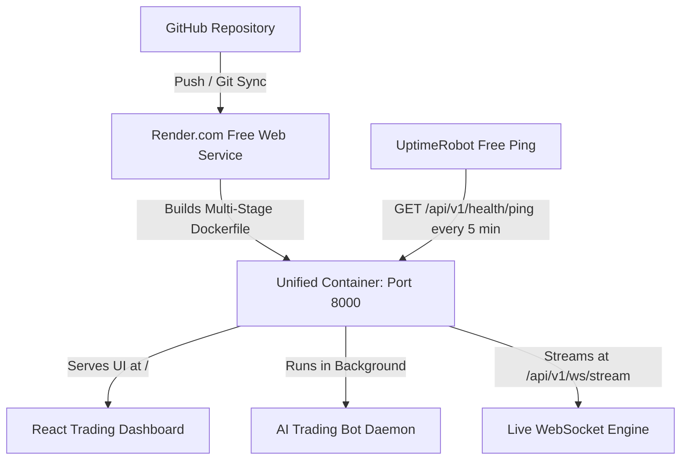

# 100% Free Cloud Deployment Guide (Render.com)

This guide walks you through deploying your autonomous AI Crypto Trading Bot to **Render.com** completely free ($0/month), running 24/7 in the cloud.

---

## Architecture Overview



- **Single Lightweight Container**: Both the React dashboard and the FastAPI trading backend run in 1 Docker container on 1 port, fitting completely within Render's free tier (512MB RAM).
- **Zero Cost**: $0 / month forever.
- **24/7 Uptime**: Using a free external monitor (UptimeRobot) to ping the keep-alive endpoint prevents the free tier from idling.

---

## Step-by-Step Deployment Instructions

### Step 1: Push Your Code to GitHub
Make sure your project changes are committed and pushed to your GitHub repository:
```bash
git add .
git commit -m "feat: configure unified single-service Docker and render.yaml for free deployment"
git push origin main
```

---

### Step 2: Create a Free Render Account
1. Visit [render.com](https://render.com) and click **Get Started**.
2. Sign in with your **GitHub** account.

---

### Step 3: Deploy Using Render Blueprint (1-Click)
1. On the Render Dashboard, click the blue **New +** button in the top-right corner.
2. Select **Blueprint**.
3. Choose your `AI-Trading-bot` repository and click **Connect**.
4. Render will read `render.yaml` automatically and display the service plan:
   - **Service Name**: `ai-trading-bot`
   - **Environment**: Docker (`Dockerfile`)
   - **Plan**: Free ($0)
   - **Region**: **Frankfurt (EU)** *(CRITICAL: Do NOT select Oregon/Ohio US regions, as Binance blocks US server IP addresses with HTTP Error 451)*
5. Click **Apply**. Render will start building the Docker container automatically!

*(Alternative: If deploying manually via **New +** -> **Web Service**, select **Frankfurt (EU)** as the region and Docker as the environment).*

---

### Step 4: Configure Your Environment Variables
In your Render Dashboard, go to your service (`ai-trading-bot`) -> **Environment**:
Verify or set the following variables:

| Variable | Recommended Value | Description |
| :--- | :--- | :--- |
| `TRADING_MODE` | `PAPER` | Safe virtual simulation with real Binance live prices ($0 risk) |
| `TRADING_ENABLED` | `true` | Allows the automated bot daemon to open/manage trades |
| `STARTING_CAPITAL` | `10000.0` | Initial balance baseline in USDT |
| `BASE_CURRENCY` | `USDT` | Base quote currency |
| `TRADING_SYMBOL` | `BTCUSDT` | Target trading pair |
| `DEFAULT_TIMEFRAME` | `1m` | Strategy candle timeframe |
| `BINANCE_TESTNET` | `true` | Uses Binance testnet endpoints |
| `BINANCE_API_KEY` | *(Your Testnet/Binance Key)* | Optional for PAPER, required for TESTNET/LIVE |
| `BINANCE_API_SECRET` | *(Your Secret Key)* | Kept secure by Render's encrypted secrets store |
| `CORS_ORIGINS` | `*` | Allows browser connection from any domain |

Click **Save Changes**. Render will automatically redeploy with the updated settings.

---

### Step 5: Keep the Bot Awake 24/7 (Prevent Free Sleep)
Render's free tier pauses web services if no HTTP requests are received for 15 minutes. To keep your trading bot continuously executing in the background 24/7/365:

1. Go to [UptimeRobot.com](https://uptimerobot.com) and create a free account.
2. Click **+ Add New Monitor**:
   - **Monitor Type**: `HTTP(s)`
   - **Friendly Name**: `Trading Bot Keep-Alive`
   - **URL (or IP)**: `https://your-bot-subdomain.onrender.com/api/v1/health/ping`
   - **Monitoring Interval**: `5 minutes`
3. Click **Create Monitor**.

Now, UptimeRobot sends a lightweight ping every 5 minutes. Your Render container stays running 24/7 in the background, executing trades autonomously!

---

## Verifying Your Live Deployment

Once Render finishes deploying (usually takes 2–3 minutes):
1. **Open Your App**: Click the URL at the top of your Render dashboard (e.g. `https://ai-trading-bot-xxxx.onrender.com`).
2. **Dashboard UI**: You will see the Black & White Trading Dashboard loading live Binance prices.
3. **Bot Status**: Click **Start Bot** or verify via `https://your-bot.onrender.com/api/v1/trading/bot/status` that:
   ```json
   {
     "is_running": true,
     "mode": "PAPER",
     "iteration_count": 120
   }
   ```
4. **WebSocket Streaming**: Open your browser's Developer Tools (`F12` -> Network -> WS) to see live ticks streaming uninterrupted over `wss://your-bot.onrender.com/api/v1/ws/stream`.
